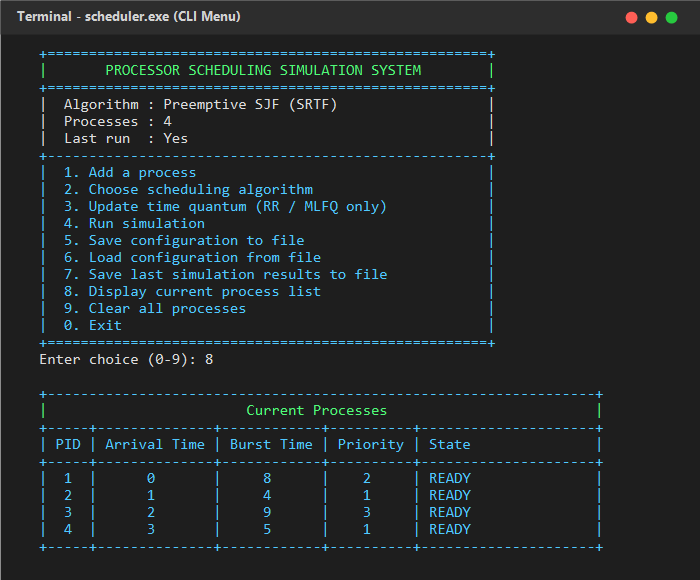
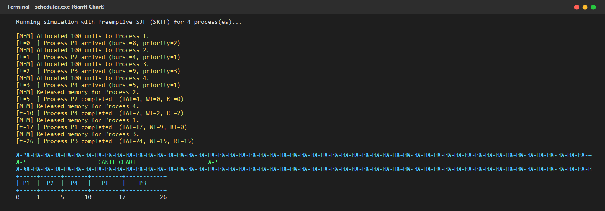
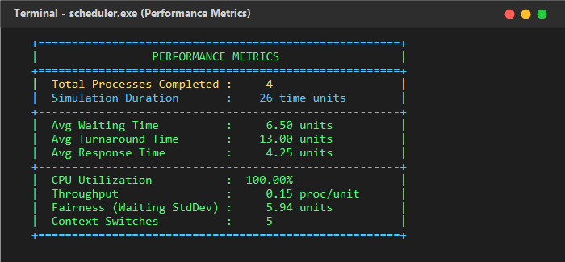

# Processor Scheduling Simulation System

A comprehensive C++17 command-line simulation of classic CPU scheduling algorithms.
The system models process scheduling, memory allocation, I/O queuing, context switching,
and performance metric collection — suitable for OS education and algorithm comparison.

---

## Features

### Scheduling Algorithms

| # | Algorithm | Type | Quantum |
|---|-----------|------|---------|
| 1 | First-Come, First-Served (FCFS) | Non-preemptive | No |
| 2 | Round Robin (RR) | Preemptive (quantum) | Yes |
| 3 | Multilevel Feedback Queue (MLFQ) | Preemptive (quantum + demotion) | Yes |
| 4 | Shortest Remaining Time First (SRTF) | Preemptive (arrival-triggered) | No |
| 5 | Preemptive Priority Scheduling | Preemptive (arrival-triggered) | No |
| 6 | Shortest Job First (SJF) | Non-preemptive | No |
| 7 | Multilevel Queue (System / User) | Hybrid | User queue |

### System Components

- **CPU Simulation** — tracks current process, simulates burst execution, handles context switching
- **Memory Manager** — allocates and deallocates fixed memory blocks per process
- **I/O Subsystem** — models I/O request queuing and BLOCKED → READY transitions
- **Simulation Log** — writes a timestamped event log to `simulation_log.txt`

### Performance Metrics (computed after each run)

| Metric | Description |
|--------|-------------|
| Avg Waiting Time | Mean time processes wait in the ready queue |
| Avg Turnaround Time | Mean time from arrival to completion |
| Avg Response Time | Mean time from arrival to first CPU access |
| CPU Utilization | Percentage of simulation time CPU was busy |
| Throughput | Completed processes per time unit |
| Fairness (Std Dev) | Standard deviation of waiting times |
| Context Switches | Total scheduling preemptions / completions |

### Gantt Chart

After each simulation a formatted Gantt chart is printed showing process execution order
with precise time boundaries.

### File I/O

- **Save configuration**: persist process list and scheduler settings to a file
- **Load configuration**: restore a saved configuration (scheduler is automatically reconstructed)
- **Save results**: save the Gantt chart and all metrics to a text file

---

## Project Structure

The project is organized into modular domain layers separating public interfaces (`include/`) from implementation (`src/`):

```
├── include/
│   ├── core/                  # Core OS abstractions (CPU, Memory, I/O, PCB, Process, Queue)
│   ├── schedulers/            # Abstract base scheduler & 7 concrete algorithm implementations
│   └── simulation/            # Engine runtime & configuration File I/O
├── src/
│   ├── core/                  # Core abstraction implementations
│   ├── schedulers/            # Algorithm implementations
│   ├── simulation/            # Engine & I/O implementations
│   └── main.cpp               # Application entry point & interactive CLI
├── screenshots/               # PNG visual demonstrations for documentation
├── CMakeLists.txt             # Modern CMake build configuration
├── Makefile                   # GNU Make build configuration
└── README.md                  # Project documentation
```

---

## Requirements

- C++17 compatible compiler: **GCC 7+**, **Clang 5+**, or **MSVC 2017+**
- (For Makefile) **GNU Make 3.81+**
- (For CMake) **CMake 3.14+**

---

## Building

### Option A — GNU Make (recommended)

```bash
# Build
make

# Build and run immediately
make run

# Clean build artefacts
make clean
```

### Option B — CMake

```bash
# Create a build directory
mkdir build && cd build

# Configure
cmake ..

# Build
cmake --build .

# Run
./scheduler        # Linux / macOS
scheduler.exe      # Windows
```

### Option C — Single g++ command

```bash
g++ -std=c++17 -Wall -Wextra -O2 \
    -Iinclude -Iinclude/core -Iinclude/schedulers -Iinclude/simulation \
    -o scheduler \
    src/core/*.cpp src/schedulers/*.cpp src/simulation/*.cpp src/main.cpp
```

> **Note:** `-std=c++17` is required (not c++11). The code uses C++17 features including
> `if`-statement initialisers.

---

## Usage

Launch the executable to enter the interactive CLI:

```
  +=====================================================+
  |       PROCESSOR SCHEDULING SIMULATION SYSTEM        |
  +=====================================================+
  |  Algorithm : None                                   |
  |  Processes : 0                                      |
  |  Last run  : No                                     |
  +-----------------------------------------------------+
  |  1. Add a process                                   |
  |  2. Choose scheduling algorithm                     |
  |  3. Update time quantum (RR / MLFQ only)            |
  |  4. Run simulation                                  |
  |  5. Save configuration to file                      |
  |  6. Load configuration from file                    |
  |  7. Save last simulation results to file            |
  |  8. Display current process list                    |
  |  9. Clear all processes                             |
  |  0. Exit                                            |
  +=====================================================+
```

### Typical workflow

1. **Add processes** (option 1) — enter Process ID, Arrival Time, Burst Time, Priority
2. **Choose algorithm** (option 2)
3. **Run simulation** (option 4)
4. Review Gantt chart and metrics printed to the terminal
5. **Save results** (option 7) if desired

### Input validation

- Process IDs must be unique and > 0
- Burst time must be ≥ 1
- Arrival time must be ≥ 0
- Time quantum must be ≥ 1
- All non-integer inputs are rejected gracefully (no crash / infinite loop)

---

## Screenshots

You can capture screenshots of the running simulation from your terminal and place them in the `screenshots/` directory to display them here:

### 1. Interactive CLI Menu & Process Management

*The real-time status header and interactive command-line interface.*

### 2. Gantt Chart Execution Visualization

*ASCII Gantt chart displaying precise execution time slices and context switches.*

### 3. Performance Metrics Analysis

*Detailed statistical breakdown of Turnaround Time, Waiting Time, Response Time, CPU Utilization, Throughput, and Fairness.*

---

## Configuration File Format

Saved by option 5, loaded by option 6:

```
Scheduling Algorithm: Round Robin
Time Quantum: 4
ProcessID,ArrivalTime,BurstTime,Priority
1,0,8,2
2,1,4,1
3,2,6,3
```

---

## Architecture

```
main.cpp                 — CLI menu, user interaction, application state
├── SimulationEngine     — drives the scheduling loop, accumulates metrics
│   ├── Scheduler*       — polymorphic scheduling interface
│   │   ├── FCFSScheduler
│   │   ├── SJFScheduler
│   │   ├── RoundRobinScheduler
│   │   ├── MLFQScheduler
│   │   ├── PreemptiveSJFScheduler
│   │   ├── PriorityScheduler
│   │   └── MultilevelQueueScheduler
│   ├── CPU              — execute CPU burst, track clock
│   ├── MemoryManager    — allocate / deallocate per-process memory
│   └── IOSubsystem      — manage blocked processes awaiting I/O
├── Process              — per-process state, timing attributes
├── ReadyQueue           — FIFO queue (used by FCFS)
├── PCB                  — Process Control Block (context save / restore)
└── FileIO               — configuration and results persistence
```

### Scheduler polymorphism

The `Scheduler` base class interface:

```cpp
class Scheduler {
    virtual void     add_process_to_queue(Process& process) = 0;
    virtual Process* get_next_process()                     = 0;
    virtual bool     is_empty()                       const = 0;
    virtual void     on_quantum_expiry(Process& process);   // default: re-add
    virtual bool     is_preemptive()                  const;// default: false
    virtual bool     should_preempt(const Process&)   const;// default: false
    virtual int      get_time_quantum()               const;// default: 0 (run to completion)
};
```

---

## Known Limitations

- Single-core CPU only (multi-core scheduling not modelled)
- No real-time scheduling algorithms (EDF, Rate Monotonic)
- I/O simulation is structural only (no random I/O interrupt generation)
- Starvation prevention (aging) not implemented for Priority Scheduling

---

## Future Enhancements

- Multi-core CPU simulation with load balancing
- Real-time scheduling: EDF, Rate Monotonic Scheduling
- Starvation prevention via priority aging
- Graphical visualisation of the Gantt chart

---

## Contributing

1. Fork the repository
2. Create a feature branch: `git checkout -b feature/your-feature`
3. Commit your changes: `git commit -m 'Add your feature'`
4. Push: `git push origin feature/your-feature`
5. Open a Pull Request

---

## License

This project is provided for educational purposes.
